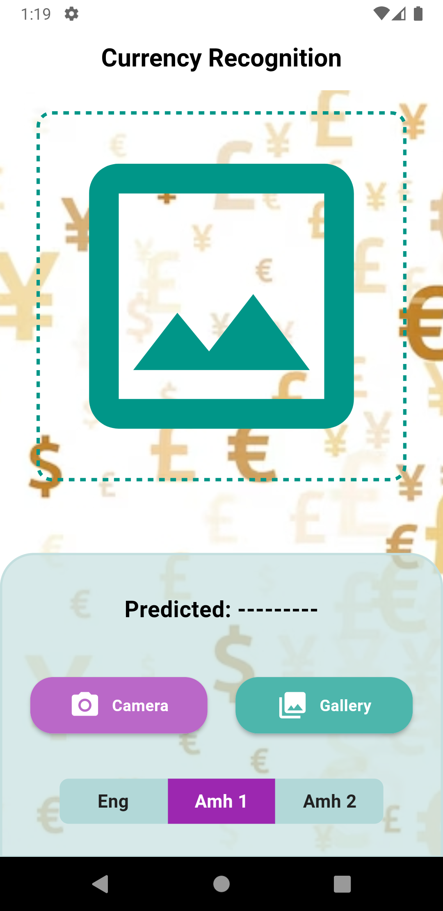
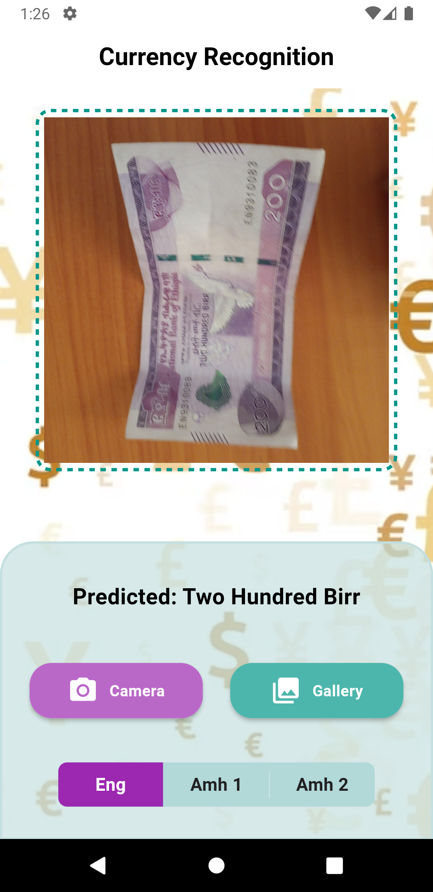
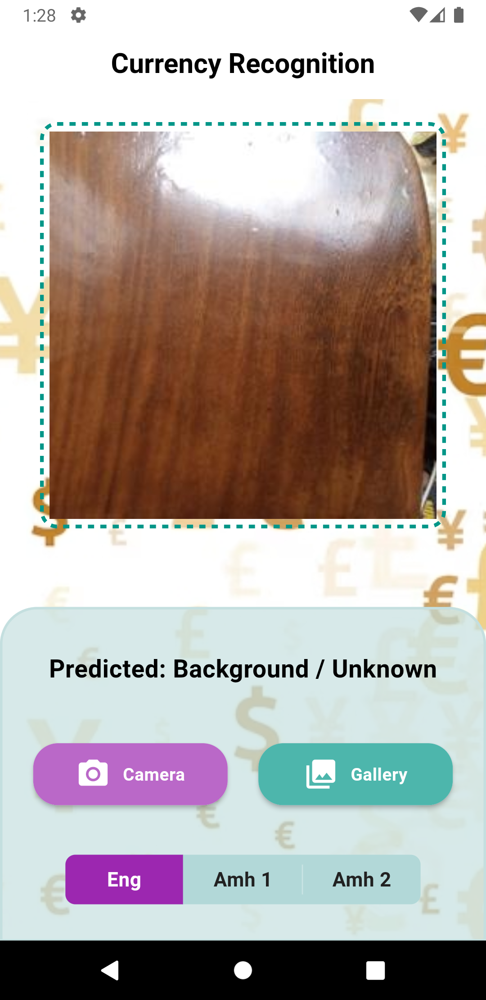
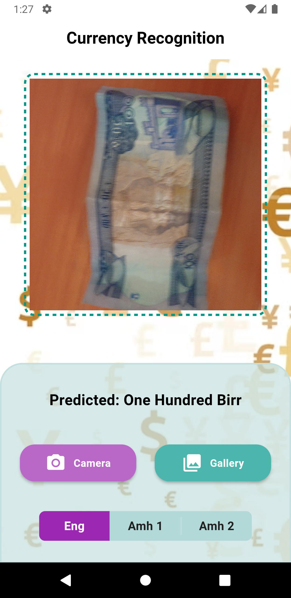
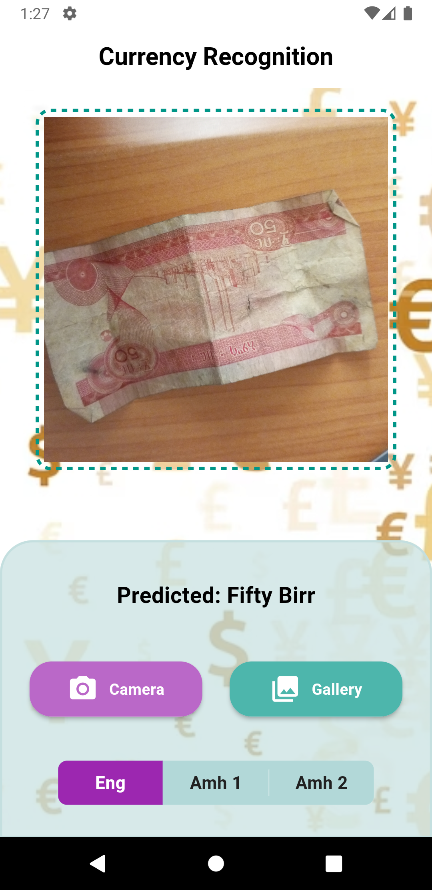

# Currency Recognizer

This project is a starting point for a Flutter application that recognizes different currencies.

## Group Members

- Abel Begashaw.........ATR/8919/13
- Eba Adisu Kenea.........UGR-2749-14
- Oliyad Mulugeta.........UGR-0055-14
- Samrawit Dawit.........UGR-0221-14
- Mati Milkessa Ensermu.........UGR-0949-14
- Iman Ibrahim.........UGR/1004/14

## Note

##### Please be aware that this model/app does not guarantee 100% accuracy and may occasionally produce incorrect results.

## Images

Here are some sample images used in the project:

